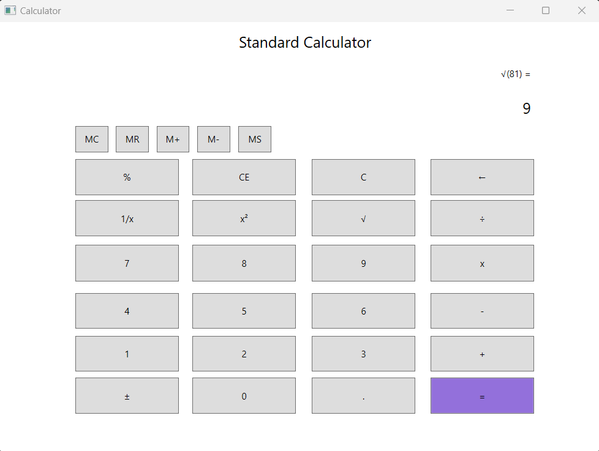

# Orderwise Assignment

## Prerequisites for building the project:
* The [.NET 7 SDK](https://dotnet.microsoft.com/en-us/download/dotnet/7.0) with .NET Desktop Runtime / .NET desktop development workload.

## Usage



<br />

The solution includes the release assets inside the `release.zip` which can be run by step `2` below.

To build and run the project, open a command prompt to the root of the solution, and perform the following: 

1. Publish the project to a folder:

    ```
    cd ./src/Calculator
    dotnet publish -o assets
    ```

2. To run the application, open a command prompt to the `assets` folder created from the previous step, and run the executable:

    ```
    Calculator
    ``` 

## In brief

This application is written in XAML and C# with WPF. NET. It follows the Model-View-ViewModel (MVVM) design pattern.

The core operations are abstracted in the `CoreApplication`. The `CoreApplication` is loosely coupled from the `View` and can be easily plugged into any client. This allows it to evolve independently of any consumer client.
